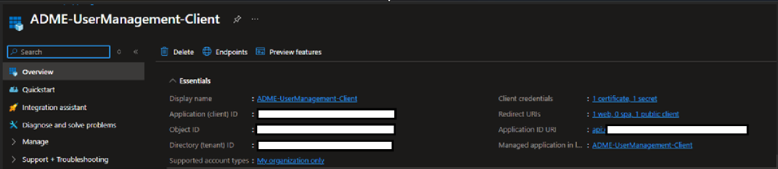
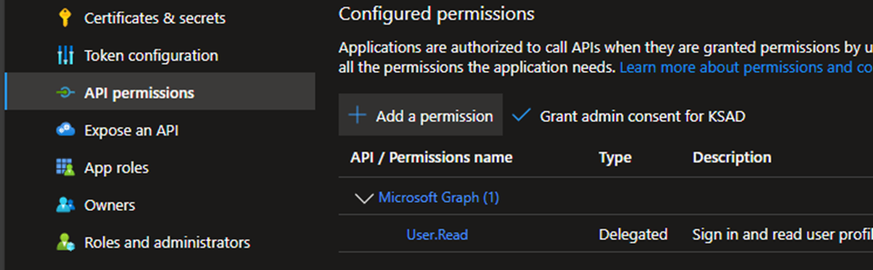
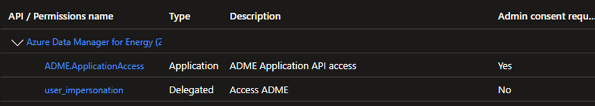
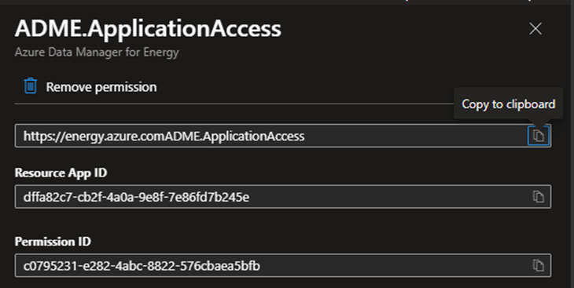
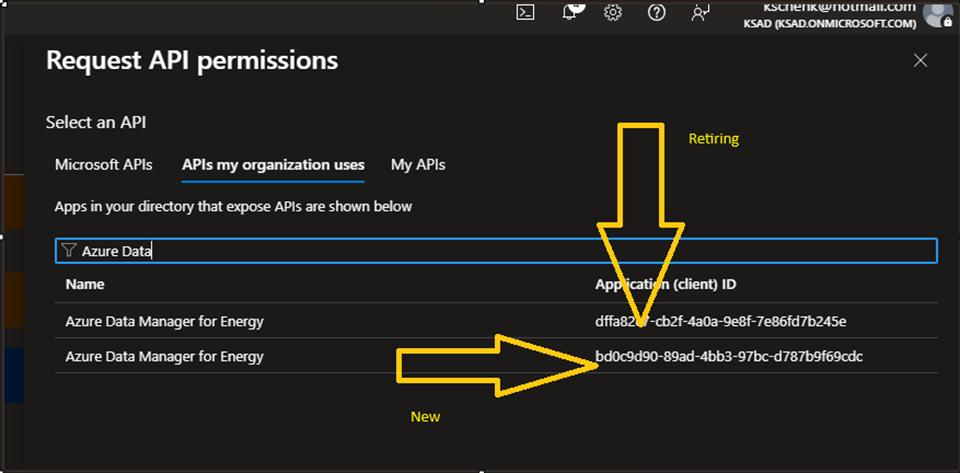
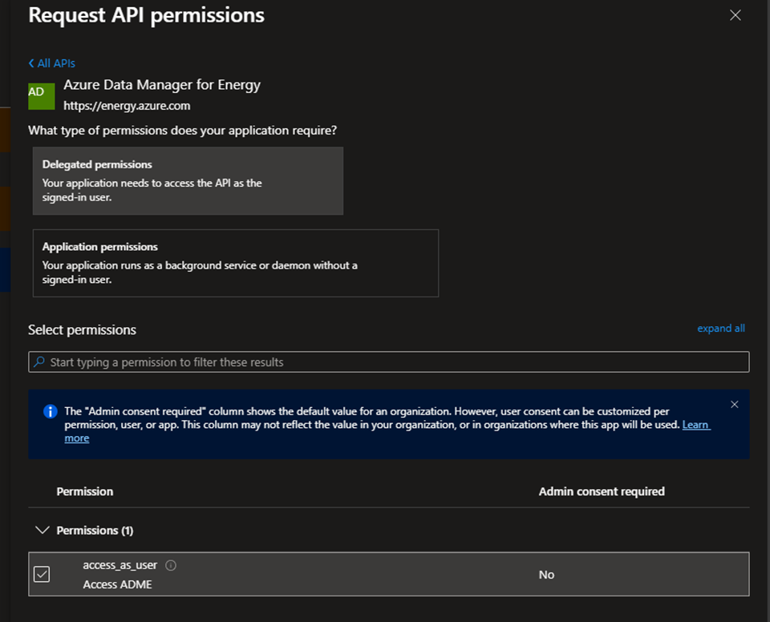

# ADME Support for Authorization with Entra ID Groups

## Overview

We are enhancing OSDU's entitlement system by allowing customers to integrate Microsoft Entra ID groups directly into access control workflows. This eliminates the need for customers to manage user memberships in multiple places, streamlining identity governance. By allowing Entra ID security groups to be added to OSDU groups, access decisions can be made dynamically at runtime using Microsoft Graph. This enables scalable, policy-driven authorization without duplicating group data. Customers gain flexibility to manage entitlements centrally, leverage dynamic group membership, take advantage of Entra ID's just-in-time (JIT) and Conditional Access policies and reduce operational overhead.

## Problem

ADME uses a 1P app to query the Entra ID graph in the customer's tenant. The current 1P app registered with ADME does not have the permissions to call into Entra ID and retrieve a user's group membership. This app needs to be updated, which cannot be done by the ADME team automatically. Customers of ADME will need to run the steps below in their environments.

## Permissions Needed

Either of the following Entra ID roles in the tenant is sufficient to perform the steps:

- Cloud Application Administrator
- Application Administrator

## Steps to switch the 1P App and enable support for Entra ID groups

### Change Audience of current 1P App

**Sign in**

```sh
az login --tenant <TENANT_ID>
```

**Find the existing Service Principal**

To find the Service Principal in your tenant that was created for dffa 1P run [find-sp.sh](src/find-sp.sh). No argument is needed because the script defaults to dffa. The Service Principal is shown by *fpaResSpId*.

```text
$ ./find-sp.sh

=== 1P FPA Application Details ===
AppId: dffa82c7-cb2f-4a0a-9e8f-7e86fd7b245e
Tenant: <TENANT>

=== Resolve 1P FPA Service Principal (by appId) ===
fpaResSpId: <dffa Service Principal>
```

**Inspect the current audiences**

Inspect *servicePrincipalNames* and other current properties of the existing dffa 1P app Service Principal by running [view-1p-app-details.sh](src/view-1p-app-details.sh).

```sh
./view-1p-app-details.sh
```

At this point, the existing dffa Service Principal might still show `https://energy.azure.com`. If so, you must refresh the Service Principal.

**Refresh the Service Principal**

Refresh the existing Service Principal by applying a temporary unique tag update using [refresh-1p-app-sp.sh](src/refresh-1p-app-sp.sh)
.
```sh
./refresh-1p-app-sp.sh apply
```

**Verify the updated audiences**

Run the inspection script [view-1p-app-details.sh](src/view-1p-app-details.sh) again.

```sh
./view-1p-app-details.sh
```

Confirm that the dffa\* Service Principal now shows `https://energy-old.azure.com` and no longer owns `https://energy.azure.com`.

**Remove the temporary refresh tag**

After verification, restore the original tags using [refresh-1p-app-sp.sh](src/refresh-1p-app-sp.sh)

```sh
./refresh-1p-app-sp.sh cleanup
```

> **Source scripts:** [find-sp.sh](src/find-sp.sh) | [view-1p-app-details.sh](src/view-1p-app-details.sh) | [refresh-1p-app-sp.sh](src/refresh-1p-app-sp.sh)

### Create the new 1P App

Now that dffa\* no longer owns `https://energy.azure.com` you can create a Service Principal for the new 1P app in your tenant(s).

```sh
az ad sp create --id bd0c9d90-89ad-4bb3-97bc-d787b9f69cdc
```

Verify the details of the new 1P app by running [view-1p-app-details.sh](src/view-1p-app-details.sh). You should see the App registered to `https://energy.azure.com`.

```sh
view-1p-app-details.sh bd0c9d90-89ad-4bb3-97bc-d787b9f69cdc
```

Output includes:

```json
"servicePrincipalNames": [
    "bd0c9d90-89ad-4bb3-97bc-d787b9f69cdc",
    "https://energy.azure.com"
]
```

### Test

You can test the changes made in Azure CLI with [test.sh](src/test.sh)

```sh
test.sh $ADME_INSTANCE
```

**Result**

```json
{
    "artifactId": "entitlements-v2-azure",
    "branch": "releases/25.7.12",
    "buildTime": "2026-03-11T16:50:06.639Z",
    "commitId": "b72800b832753393097e9294bd15a58ea29021ca",
    "commitMessage": "Merged PR 20215: Fix: rename deprecated server.max-http-header-size to server.max-http-request-header-size",
    "connectedOuterServices": [],
    "groupId": "org.opengroup.osdu.entitlements.v2",
    "version": "0.28.2-SNAPSHOT"
}
```

The steps above complete the work needed to enable support for Entra ID groups in OSDU entitlements. If you have existing App Registrations in one or more tenants (aka. 3P app) which you would like to continue using with the ability to authorize with AAD groups, please follow the steps below.

### Update App Registration

a. Navigate to your App Registration in the Azure portal.

   

b. Go to **Manage** -> **Authentication** -> **API Permissions**

   

c. Delete any existing API permissions for "Azure Data Manager for Energy" if it refers to the retiring First Party Application, which you can confirm by clicking on the permission and confirming whether it is dffa\*.

   

   

d. Click on **"Add a permission"** -> **"APIs my organization uses"** and search for Azure Data Manager for Energy and select bd0c\*

   

e. Select **Delegated permissions** in ourder to use this feature

   

f. Save to see something like below

   

### Test App Registration

You can test getting a token using the OAuth Authorization Code Flow with [get-token.py](src/get-token.py).
