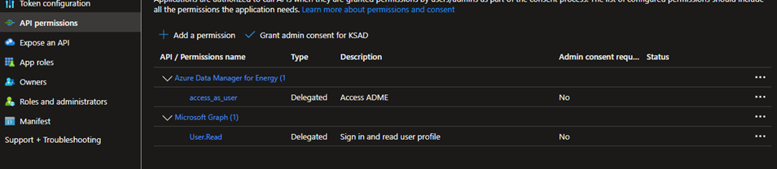

# Enable Entra ID groups authorization in Azure Data Manager for Energy

This article shows how to enable Microsoft Entra ID groups authorization for OSDU entitlements in Azure Data Manager for Energy by switching from the retiring first-party application (`dffa82c7-cb2f-4a0a-9e8f-7e86fd7b245e`) to the replacement application (`bd0c9d90-89ad-4bb3-97bc-d787b9f69cdc`).

The primary customer workflow now uses these scripts:

- `src/adme-entra-inventory.sh`
- `src/adme-entra-migration.sh`
- `src/Invoke-AdmeMigration.ps1`

> [!NOTE]
> Run the commands in this article from the `entra-id-groups-authorization/` directory.

> [!TIP]
> Start with [PREREQUISITES.md](PREREQUISITES.md) for Azure Cloud Shell, Linux, and WSL setup guidance.

> [!NOTE]
> Older helper tooling is still available in [`src/supplemental/`](src/supplemental/README.md), but it is no longer the primary customer workflow.

## Workflow at a glance

1. Run inventory to confirm the current tenant state and identify affected client applications.
2. Run `--yes migrate adme-audience` once in the customer tenant.
3. Run `migrate api-permissions` once for each affected client application.
4. Run `verify` to confirm the audience migration and token paths.
5. Review the updated app registration in the Azure portal and complete admin consent if required.

## Before you begin

You need one of the following Entra roles in the target tenant:

- Application Administrator
- Cloud Application Administrator
- Global Administrator

## Step 1: Run inventory

Use the inventory script to confirm whether the tenant is pre-migration, partially migrated, or already migrated.

```azurecli
./src/adme-entra-inventory.sh
```

The script writes structured logs under `./inventory-logs/` and inventory artifacts under `./inventory-output/`.

Example output excerpt before migration:

```text
[INFO] STEP: Validating local prerequisites
[INFO] STEP: Validating current Azure CLI tenant context
[INFO] OK: Using tenantId=<tenant-id>
[INFO] STEP: Checking Microsoft Graph access for scope 'all'
[INFO] OK: Resolved dffa service principal
[INFO] OK: Resolved bd0c service principal
[INFO] OK: Preflight passed for scope 'all' in tenant <tenant-id>
[INFO] STEP: Discovering app-role assignments to the old resource (dffa)
[INFO] STEP: Discovering app-role assignments to the new resource (bd0c)
[INFO] STEP: Discovering delegated grants to the old resource (dffa)
[INFO] STEP: Discovering delegated grants to the new resource (bd0c)
[INFO] STEP: Discovering app registrations with configured old resource (dffa) or new resource (bd0c) API permissions
⚠️ AUDIENCE NOT MIGRATED — old resource (dffa) still owns https://energy.azure.com
Inventory summary
  tenantId: <tenant-id>
  scope: all
  sharedAudienceUri: https://energy.azure.com
  sharedAudienceOwner: dffa
  migrationState: pre-migration
  dffa companion: ./inventory-output/dffa-sp-<timestamp>.json
  bd0c companion: ./inventory-output/bd0c-sp-<timestamp>.json
  summary file: ./inventory-output/inventory-summary-<timestamp>.json
  3p inventory: ./inventory-output/3p-inventory-<timestamp>.json
Per-app consent status
  ⏳ API permissions update needed — <client-app-name>
    appId: <client-app-id>
    detail: App still has API permissions for the old resource (dffa) but does not yet have the replacement new resource (bd0c) API permissions.
Next steps
  For <client-app-name>: run the audience migration first, then run the API-permissions migration for this app in the same change window.
  ./src/adme-entra-migration.sh --yes migrate adme-audience
  ./src/adme-entra-migration.sh migrate api-permissions --client-id <client-app-id>
```

Treat **Per-app consent status** as a client-app planning signal. Current ADME telemetry does not show use of **dffa**. This means that even if some client applications still have API permissions defined for **dffa**, that access is not being used based on this telemetry.

You can choose the option that best matches your operating posture:

1. Run **Step 2** followed immediately by **Step 3** without planning for downtime, based on the current telemetry.
2. Take the more cautious approach and schedule a downtime window. If inventory shows **API permissions update needed**, run **Step 3** immediately after **Step 2** for those apps. If inventory shows **Admin consent needed**, complete that consent in the same change window so affected apps do not remain in a partially migrated state.

Use the **Per-app consent status** lines written to standard output to identify which client applications still reference the retiring resource, which ones will need the API-permissions migration, and which ones may require admin consent. The generated `3p-inventory-<timestamp>.json` file is available if you want a saved copy for later review.

## Step 2: Run the audience migration

Run the audience migration once in the customer tenant to refresh the old service principal state, provision the replacement service principal, and wire the Azure CLI delegated grant.

```azurecli
./src/adme-entra-migration.sh --yes migrate adme-audience
```

> [!TIP]
> PowerShell alternative:
>
> ```powershell
> ./src/Invoke-AdmeMigration.ps1 --yes migrate adme-audience
> ```

The migration script writes structured logs under `./migration-logs/`.

Example output excerpt:

```text
[INFO] Starting command: migrate adme-audience
[INFO] Log file: ./migration-logs/adme-entra-migration-<timestamp>.log
[INFO] STEP: Loading runtime state and validating adme-audience prerequisites
[INFO] OK: Customer Azure CLI context is ready for tenant <tenant-id>
[INFO] OK: Current user principal <operator-object-id> has required role 'Global Administrator'
[INFO] Preflight:
[INFO]   customer tenant: <tenant-id>
[INFO]   old resource (dffa) customer servicePrincipalId: <dffa-sp-id>
[INFO]   new resource (bd0c) appId to provision in customer tenant: bd0c9d90-89ad-4bb3-97bc-d787b9f69cdc
[INFO]   expected new resource (bd0c) identifierUri: https://energy.azure.com
[INFO]   fallback mode: default safe stop if refresh remains stale
[INFO] STEP: Applying a temporary refresh probe tag to the stale old resource (dffa) customer service principal
[INFO] OK: Applied refresh probe tag
[INFO] STEP: Polling for the refreshed old resource (dffa) servicePrincipalNames
[INFO] OK: old resource (dffa) customer servicePrincipalNames refreshed on attempt 1
[INFO] STEP: Removing the temporary refresh probe tag
[INFO] STEP: Ensuring new resource (bd0c) exists in the customer tenant
[INFO] OK: Verified customer new resource (bd0c) servicePrincipalNames
[INFO] STEP: Ensuring Azure CLI can request the new resource (bd0c) delegated scope non-interactively
[INFO] SUMMARY: migrate adme-audience complete
```

If you rerun inventory immediately after the audience migration, a partial state is expected until you update each affected client application:

```text
✅ AUDIENCE MIGRATED — new resource (bd0c) owns https://energy.azure.com

Inventory summary
  tenantId: <tenant-id>
  scope: all
  sharedAudienceUri: https://energy.azure.com
  sharedAudienceOwner: bd0c
  migrationState: partial
Per-app consent status
  API permissions update needed — <client-app-name-1>
  API permissions update needed — <client-app-name-2>
Next steps
  Run the API-permissions migration to update app registrations and print any required consent/grant follow-up:
  ./src/adme-entra-migration.sh migrate api-permissions --client-id <client-app-id>
```

> [!NOTE]
> By default, the migration first tries to refresh the old `dffa` service principal in place. If it still remains stale and you have confirmed it is not being used, you can rerun with `--allow-recreate-dffa` to let the script safely delete and recreate that service principal.

## Step 3: Run the API-permissions migration for each affected client app

After the audience migration succeeds, run the API-permissions migration once for each affected client application reported by inventory.

```azurecli
./src/adme-entra-migration.sh migrate api-permissions --client-id <client-app-id-or-service-principal-id>
```

> [!TIP]
> PowerShell alternative:
>
> ```powershell
> ./src/Invoke-AdmeMigration.ps1 migrate api-permissions --client-id <client-app-id-or-service-principal-id>
> ```

By default, this command updates `requiredResourceAccess` and then prints the one tenant-wide admin-consent action that the operator should complete in the Azure portal. If you want the script to create the delegated grant and app-role assignment programmatically, use `--auto-grant`.

Example output excerpt on the default path:

```text
[INFO] Starting command: migrate api-permissions
[INFO] Log file: ./migration-logs/adme-entra-migration-<timestamp>.log
[INFO] STEP: Loading runtime state and validating api-permissions prerequisites
[INFO] OK: Customer Azure CLI context is ready for tenant <tenant-id>
[INFO] OK: Current user principal <operator-object-id> has required role 'Global Administrator'
[INFO] Resolved --client-id '<client-app-id>' to client app '<client-app-name>'
[INFO]   client appId: <client-app-id>
[INFO]   client applicationObjectId: <client-application-object-id>
[INFO]   client servicePrincipalId: <client-service-principal-id>
[INFO] Target resource capabilities: permissionShape=Role + Scope enabledAppRoles=1 enabledScopes=1
[INFO] Preflight:
[INFO]   customer tenant: <tenant-id>
[INFO]   client app appId: <client-app-id>
[INFO]   new resource (bd0c) appId: bd0c9d90-89ad-4bb3-97bc-d787b9f69cdc
[INFO]   new resource (bd0c) servicePrincipalId: <bd0c-sp-id>
[INFO]   app role to grant: ADME.ApplicationAccess (<app-role-id>)
[INFO]   delegated scope to preserve in requiredResourceAccess: access_as_user (<scope-id>)
[INFO]   requiredResourceAccess target shape: Role + Scope
[INFO]   customer-app consent mode: default manual admin-consent action
[INFO] Complete one tenant-wide admin-consent action for the updated customer app to grant both the target-resource app role and delegated scope.
[INFO] Azure portal: App registrations -> client app -> API permissions -> Grant admin consent
[INFO] Portal link: https://portal.azure.com/#view/Microsoft_AAD_RegisteredApps/ApplicationsListBlade
[INFO] OK: Updated client app requiredResourceAccess to new resource (bd0c)
[INFO] SUMMARY: migrate api-permissions complete
[INFO]   customer app grants were not modified on the default path
```

If you use `--auto-grant`, the log also includes lines confirming the app-role assignment and delegated grant creation for that selected client app.

## Step 4: Run verify

Run verify after the migrations to confirm the audience migration and token paths.

```azurecli
./src/adme-entra-migration.sh verify
```

> [!TIP]
> PowerShell alternative:
>
> ```powershell
> ./src/Invoke-AdmeMigration.ps1 verify
> ```

If the first verify run reports that the Azure CLI delegated token still needs one-time interactive consent, complete that consent once and rerun verify:

```azurecli
az login --tenant "<tenant-id>" --scope "https://energy.azure.com/access_as_user" --allow-no-subscriptions
```

Example output when operator action is still required:

```text
[INFO] Starting command: verify
[INFO] Log file: ./migration-logs/adme-entra-migration-<timestamp>.log
[INFO] STEP: Loading runtime state and validating verify prerequisites
[INFO] OK: Customer Azure CLI context is ready for tenant <tenant-id>
[INFO] STEP: Checking customer-tenant service principal state
[INFO] OK: Verified customer old resource (dffa) no longer owns shared audience
[INFO] OK: Verified customer new resource (bd0c) owns shared audience
[INFO] STEP: Checking the Azure CLI delegated grant wiring for new resource (bd0c)
[INFO] OK: Verified Azure CLI delegated grant wiring for new resource (bd0c) scope 'access_as_user'
[INFO] STEP: Validating the Azure CLI delegated token diagnostic
[WARN] Azure CLI forced-refresh delegated token request still requires one-time interactive consent
[WARN] Run once: az login --tenant "<tenant-id>" --scope "https://energy.azure.com/access_as_user" --allow-no-subscriptions
[ERROR] FAIL: Azure CLI delegated diagnostic is blocked until the operator completes the one-time Azure CLI consent
[INFO] Verify status
[INFO]   OK Audience migration - new resource (bd0c) owns shared audience
[WARN]   WAIT Azure CLI delegated token - action needed; see the earlier FAIL/remedy lines
[INFO]   INFO Selected-client app-only proof - skipped because --client-id was not provided
[ERROR] SUMMARY: verify found 1 failing check(s)
```

If you also want to prove the post-migration app-only token path for a specific customer app, provide `--client-id` and a client secret through `CLIENT_SECRET`:

```azurecli
CLIENT_SECRET="<client-secret>" ./src/adme-entra-migration.sh verify --client-id <client-app-id>
```

> [!TIP]
> PowerShell alternative:
>
> ```powershell
> $env:CLIENT_SECRET = "<client-secret>"
> ./src/Invoke-AdmeMigration.ps1 verify --client-id <client-app-id>
> ```

Example output for the selected-client app-only proof:

```text
[INFO] Starting command: verify
[INFO] Log file: ./migration-logs/adme-entra-migration-<timestamp>.log
[INFO] STEP: Loading runtime state and validating verify prerequisites
[INFO] OK: Customer Azure CLI context is ready for tenant <tenant-id>
[INFO] Resolved --client-id '<client-app-id>' to client app '<client-app-name>'
[INFO]   client appId: <client-app-id>
[INFO]   client applicationObjectId: <client-application-object-id>
[INFO]   client servicePrincipalId: <client-service-principal-id>
[INFO] STEP: Checking customer-tenant service principal state
[INFO] OK: Verified customer old resource (dffa) no longer owns shared audience
[INFO] OK: Verified customer new resource (bd0c) owns shared audience
[INFO] STEP: Validating selected-client runtime token proof
[INFO] STEP: Validating the post-migration app-only token
[INFO] OK: Verified app-only token aud=bd0c9d90-89ad-4bb3-97bc-d787b9f69cdc azp=<client-app-id>
[INFO] Verify status
[INFO]   OK Audience migration - new resource (bd0c) owns https://energy.azure.com
[INFO]   OK App-only token proof - passed
[INFO]   INFO Azure CLI delegated token - skipped because --client-id verifies the selected customer app; run verify without --client-id for Azure CLI delegated proof
[INFO] SUMMARY: verify complete - selected-client app-only token proof passed
```

## Step 5: Review the updated app registration in the Azure portal

After the script updates the client application's `requiredResourceAccess`, review the result in the Azure portal and complete admin consent if your tenant requires it.

1. In the [Azure portal](https://portal.azure.com/), go to **Microsoft Entra ID** > **App registrations** and open the client application that you migrated.

   

2. Open **Manage** > **API permissions**.

   

3. Confirm that **Azure Data Manager for Energy** now references the replacement application (`bd0c9d90-89ad-4bb3-97bc-d787b9f69cdc`) and use **Grant admin consent** if your tenant policy requires it.

   

> [!IMPORTANT]
> Updating the permission entry alone is not always sufficient. Until consent is complete, delegated tokens can still fail even when the app registration already references the replacement resource.

## Troubleshooting

- **Inventory can't see delegated grants**: rerun inventory with `--scope adme-1p-service-principals` to get the dffa/bd0c service-principal state only, then resolve Microsoft Graph read access before returning to full inventory.
- **`migrate api-permissions` says the bd0c service principal is missing**: rerun Step 2 first. The customer tenant must already contain the replacement service principal before client-app permissions can be updated.
- **`verify` asks for one-time Azure CLI consent**: run `az login --tenant "<tenant-id>" --scope "https://energy.azure.com/access_as_user" --allow-no-subscriptions` once, then rerun verify.
- **You need the legacy helper workflow for investigation**: use the scripts documented in [`src/supplemental/README.md`](src/supplemental/README.md), but keep the main migration path on the 3 primary scripts in `src/`.

## Next steps

- Use [PREREQUISITES.md](PREREQUISITES.md) to prepare additional operator environments.
- If you want an application smoke test against your ADME endpoint after verify passes, run `./src/test.sh <adme-instance-host>`.
